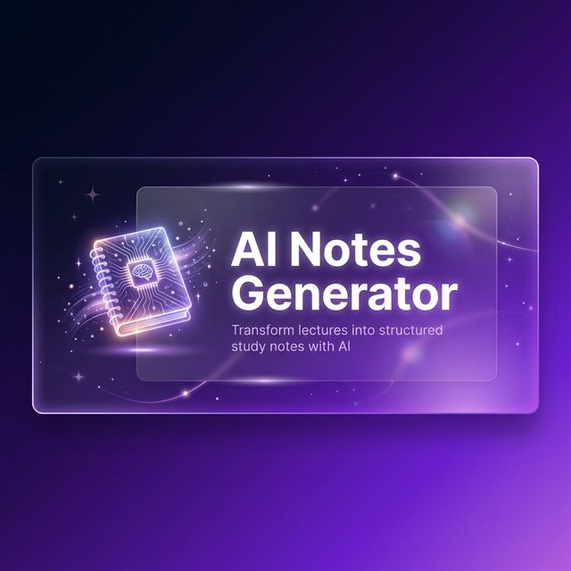
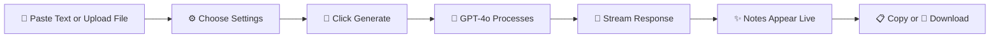

<p align="center">
  
</p>

<h1 align="center">✨ AI Notes Generator</h1>

<p align="center">
  <strong>Transform your lecture text into clean, structured study notes — powered by OpenAI GPT-4o with real-time streaming.</strong>
</p>

<p align="center">
  <a href="#features">Features</a> •
  <a href="#demo">Demo</a> •
  <a href="#tech-stack">Tech Stack</a> •
  <a href="#getting-started">Getting Started</a> •
  <a href="#project-structure">Project Structure</a> •
  <a href="#deployment">Deployment</a> •
  <a href="#contributing">Contributing</a> •
  <a href="#license">License</a>
</p>

<p align="center">
  
  
  
  
</p>

---

## 🎯 About

**AI Notes Generator** is a modern web app that takes raw lecture text, textbook passages, or any educational content and converts it into beautifully formatted, structured study notes using AI.

Notes are **streamed in real-time** — you see them appear word-by-word with an animated cursor, just like ChatGPT.

---

## ✨ Features

| Feature | Description |
|---------|-------------|
| 🔄 **Real-time Streaming** | Notes appear word-by-word with an animated blinking cursor |
| 📋 **3 Note Formats** | Bullet Points • Numbered Outline • Cornell Notes |
| 🎓 **Tone Control** | Formal academic or casual friendly tone |
| 📖 **Detail Levels** | Brief summary or comprehensive detailed notes |
| 📎 **File Upload** | Upload PDF, DOCX, DOC, or TXT files — text is extracted automatically |
| 📑 **Copy to Clipboard** | One-click copy with a toast notification |
| 💾 **Download as .md** | Export your notes as a Markdown file |
| 🔢 **Live Counters** | Word count + character count (10K char limit) |
| ⏹️ **Stop Generation** | Cancel the AI stream at any time |
| 📝 **Example Text** | Pre-loaded Machine Learning lecture for quick testing |
| 📱 **Fully Responsive** | Side-by-side on desktop, stacked on mobile |
| 🌙 **Premium Dark UI** | Glassmorphism, gradient accents, animated background orbs |

---

## 🖼️ Demo

<p align="center">
  
</p>

> **Live Demo**: Coming soon on Vercel

---

## 🛠️ Tech Stack

| Technology | Purpose |
|-----------|---------|
| [Next.js 15](https://nextjs.org/) | React framework with App Router & API Routes |
| [OpenAI GPT-4o](https://platform.openai.com/) | AI-powered note generation with streaming |
| [TypeScript](https://www.typescriptlang.org/) | Type-safe development |
| [Tailwind CSS](https://tailwindcss.com/) | Utility-first CSS framework |
| [React Markdown](https://github.com/remarkjs/react-markdown) | Render Markdown output |
| [remark-gfm](https://github.com/remarkjs/remark-gfm) | GitHub Flavored Markdown support |
| [Lucide React](https://lucide.dev/) | Beautiful SVG icons |
| [pdf-parse](https://www.npmjs.com/package/pdf-parse) | Extract text from PDF files |
| [Mammoth](https://www.npmjs.com/package/mammoth) | Extract text from DOCX files |

---

## 🚀 Getting Started

### Prerequisites

- [Node.js](https://nodejs.org/) 18+ installed
- An [OpenAI API key](https://platform.openai.com/api-keys)

### Installation

1. **Clone the repository**

   ```bash
   git clone https://github.com/manishsuthar7/AI-Notes-Generator.git
   cd AI-Notes-Generator
   ```

2. **Install dependencies**

   ```bash
   npm install
   ```

3. **Set up your API key**

   Create a `.env.local` file in the root directory:

   ```bash
   cp .env.local.example .env.local
   ```

   Then add your OpenAI API key:

   ```env
   OPENAI_API_KEY=sk-...your-key-here...
   ```

4. **Start the development server**

   ```bash
   npm run dev
   ```

5. **Open your browser**

   Navigate to [http://localhost:3000](http://localhost:3000) 🎉

---

## 📁 Project Structure

```
ai-notes/
├── app/
│   ├── api/
│   │   ├── generate-notes/
│   │   │   └── route.ts          # Streaming OpenAI endpoint
│   │   └── parse-file/
│   │       └── route.ts          # PDF/DOCX/TXT text extraction
│   ├── globals.css               # Dark theme, glass cards, animations
│   ├── layout.tsx                # Root layout + SEO metadata
│   └── page.tsx                  # Main two-panel UI
├── components/
│   ├── LoadingDots.tsx           # Animated loading indicator
│   ├── NotesOutput.tsx           # Streamed markdown output + Copy/Download
│   └── SettingsPanel.tsx         # Format / Tone / Detail pill selectors
├── public/
│   └── banner.png                # README banner image
├── .env.local.example            # API key template
├── .gitignore                    # Git ignore rules
├── next.config.ts                # Next.js configuration
├── package.json                  # Dependencies & scripts
├── postcss.config.mjs            # PostCSS config for Tailwind
├── tailwind.config.ts            # Tailwind CSS config
├── tsconfig.json                 # TypeScript config
└── README.md                     # You are here!
```

---

## 🎨 Design Highlights

- **Color Palette** — Deep dark `#0a0a0f` background with `#7c3aed` → `#a855f7` violet gradient accents
- **Glassmorphism** — Cards with `backdrop-filter: blur(20px)` for a frosted glass effect
- **Streaming Cursor** — Blinking cursor animation while notes are being generated
- **Floating Orbs** — Animated gradient orbs in the background for depth
- **Micro-animations** — Hover effects, button pulses, fade-ins, and toast slide-ups
- **Responsive** — Clean stacked layout on mobile, side-by-side panels on desktop

---

## 🌐 Deployment

### Deploy on Vercel (Recommended)

1. Push your code to GitHub
2. Go to [vercel.com](https://vercel.com) → **Import Project**
3. Select your GitHub repository
4. Add environment variable:
   - `OPENAI_API_KEY` = your OpenAI API key
5. Click **Deploy** 🚀

[](https://vercel.com/new/clone?repository-url=https://github.com/manishsuthar7/AI-Notes-Generator&env=OPENAI_API_KEY&envDescription=Your%20OpenAI%20API%20key&project-name=ai-notes-generator)

---

## 📝 How It Works



1. **Input** — Paste lecture text into the textarea, or upload a PDF/DOCX/TXT file
2. **Configure** — Select your preferred format, tone, and detail level
3. **Generate** — Click "Generate Notes" to send to GPT-4o
4. **Stream** — Watch notes appear in real-time with a blinking cursor
5. **Export** — Copy to clipboard or download as a `.md` file

---

## 🤝 Contributing

Contributions, issues, and feature requests are welcome!

1. Fork the repository
2. Create your feature branch (`git checkout -b feature/amazing-feature`)
3. Commit your changes (`git commit -m 'Add amazing feature'`)
4. Push to the branch (`git push origin feature/amazing-feature`)
5. Open a Pull Request

---

## 📄 License

This project is open source and available under the [webtechpoint License](LICENSE).

---

## ⭐ Show Your Support

If you found this project helpful, please give it a ⭐ on GitHub!

---

<p align="center">
  Made with 💜 by <a href="https://github.com/manishsuthar7">Manish by webtechpoint</a>
</p>
